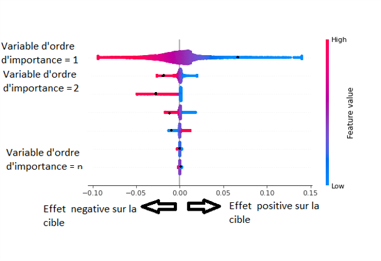
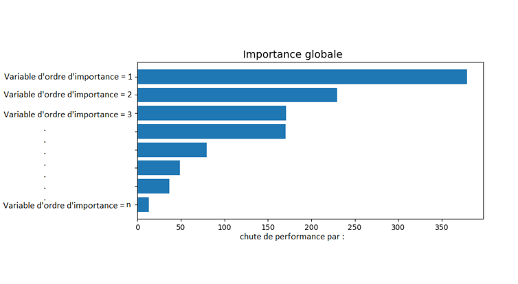
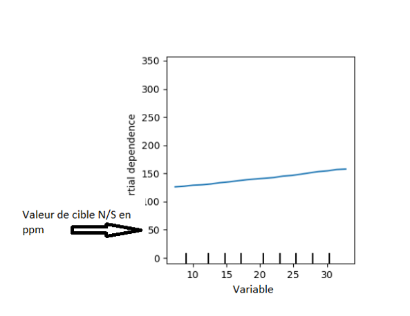
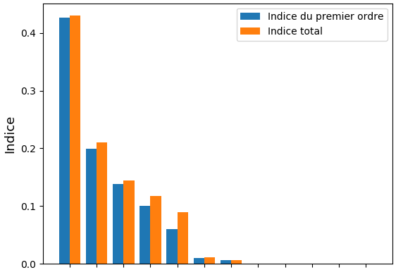

# Projet Benchmark 

##  Structure du projet
```bash

Benchmark/
├── data/                               # Données  
│   ├── real bdd modif.xlsx             # Données expérimentales réelles (privé)
│   ├── simulated_results.csv           # (old_bdd) Base de référence    (privé)
│   ├── synthetic_dataset_filtered.csv  # (new_bdd) Base optimale 
│   └── perturbed_data.csv              #           Base perturbée
│
├── data_generation/                    # Scripts bloc 1 : données
│   ├── bdd_synthetique.py              #  Génère la base optimale 
│   └── simulate_data.py                #  Génère la base de référence 
│
├── models/                             # Scripts bloc 2 :  ML
│   ├── train_models.py                 # (Base de référence) Entraîne SVM/MLP/Lasso/Poly/GBR
│   └── new_bdd_models/                 # (Base optimale) Scripts dédiés par modèle
│       ├── SVR_BDD_New.py              # SVR
│       ├── RF_BDD_New.py               # Random Forest
│       ├── REG_Poly_BDD_New.py         # Polynomial Regression
│       └── MLP_BDD_New.py              # MLP
│
├── interpretability/                   # Scripts bloc 3 : XAI
│   └── Sensitivity.py                  # lance un etude de sensitivité delta sur (Base de référence)
│   └── Sobol_index.py                  # Calcule les indices de sobol sur (Base de référence)
│   └── Explainability_Analysis.py      # lance XAI (SHAP / PFI / PDP / LIME) sur (Base de référence)
│   └── new_bdd_XAI                     # XAI sur (Base optimale) par modèle
│       ├── SVR_BDD_NEW_EXP.py          # XAI sur SVR
│       ├── REG_Poly_BDD_NEW_EXP.py     # XAI sur Polynomial Regression
│       ├── RF_BDD_NEW_EXP.py           # XAI sur Random Forest
│       └── MLP_BDD_NEW_EXP.py          # XAI sur MLP
│
├── evaluation/                         # Scripts bloc 4 : Robustesse 
│   ├──Fidelite                         # Contient calibration modèle ML + explication XAI de la base perturbée   
│   ├── Robustesse_LIME.py              # LIME
│   ├── Robustesse_PFI.py               # PFI                       
│   └── Robustesse_SHAP.py              # SHAP
│
├── src/                                # Package 
│   └── benchmark/
│       ├── __init__.py
│       ├── io.py                       # Chemins: DATA/MODELS/XAI 
│       ├── config.py                   # FEATURES, TARGETS, SEED
│       ├── physics.py                  # simulate_row / system     (privé)
│       └── data/
│           └── datasets.py             # get_df("old_bdd"/"new_bdd")
│
│
├── pyproject.toml                      # Projet Poetry (package = "benchmark")
├── README.md                           # ce fichier
└── setup_env.ps1                       # Preparation de l'environnement virtuelle de projet (privé)
```
---

##  Objectifs du projet

1. Générer des données (base de référence et base optimale).
2. Entraîner plusieurs régressions (SVM, Lasso, Polynomial, MLP, GBR, RF).
3. Comparer les performances (R², MAE, RMSE, MAPE).
4. Analyser la sensibilité du modèle physique
5. Appliquer des méthodes d’interprétabilité : SHAP, LIME, PDP, PFI 
6. Analyser la robustesse des méthodes XAI

---

## Jeu de données
* base de référence : data/simulated_results.csv 
* base de optimale  : data/synthetic_dataset_filtered.csv 
* base perturbée    : data/perturbed_data.csv

Chargement unifié dans le code :
```bash

from benchmark.data.datasets import get_df
df_old = get_df("old_bdd")
df_new = get_df("new_bdd")
```
---

## Règles d'explicabilité (XAI)
- base de référence (scripts centralisés fournis) :
        Split stratifié par Nom_charge.
        SHAP : background = train, explication = test.
        PFI/PDP/LIME : évalués sur le test (explainer LIME entraîné sur train).

- base optimale :
        Entraînements sur 100 lignes alétoires de train et test sur 10 lignes alétoires 


--- 


## Guide d’interprétation des graphes XAI et Sobol
Cette partie présente des éléments méthodologiques permettant de comprendre et d’interpréter correctement les graphiques générés par les différentes méthodes d’explicabilité utilisées dans ce projet.
### 1. Graphe de Beeswarm
— La position sur l’axe horizontal traduit l’impact de la variable sur la sortie (valeurs positives augmentent la prédiction, négatives la diminuent).

— La couleur (rouge/bleu) correspond à la valeur de la variable (élevée ou faible).

— L’interprétation se fait à la fois au niveau local (pour une observation) et global (pour l’ensemble du jeu de données). 

Exemple de graphe Beeswarm pour les valeurs SHAP :
<p align="center">
  
</p>

### 2. Graphe d’importance globale
— Plus la barre est grande, plus la variable est jugée importante.

— Ces résultats sont globaux et permettent de classer les variables par ordre d’importance.

Exemple de graphe d’importance globale pour la méthode LIME/PFI :
<p align="center">
  
</p>

### 3. Graphe de dépendance
— Distribution la sortie (N/S) des données test en fonction de chaque variable.

— Information sur la nature de la relation entre variable et cible (linéaire, non linéaire, corrélation, Independence . . .).

— Les histogrammes représentent la population des données expliquées. 

Exemple de graphe de dépendance pour la méthode PDP :
<p align="center">
  
</p>

### 4. Indices de Sobol
Les indices de Sobol sont représentés par des barres indiquant la part de variance expliquée par chaque variable d’entrée.

— L’indice de premier ordre mesure l’effet direct d’une variable.

— L’indice total prend en compte à la fois l’effet direct et les interactions.

— Plus l’indice est élevé, plus la variable contribue à l’incertitude globale de la sortie.

Exemple de représentation graphique des indices de Sobol :
<p align="center">
  
</p>

 
## Installation & Environnement
Poetry + venv gérés par setup_env.ps1   (Privé)


---

## Technologies & Librairies
```bash

python = "3.11"
pandas = "2.2.2"
numpy = "1.26.4"
scikit-learn = "1.4.2"
matplotlib = "3.8.4"
seaborn = "0.13.2"
shap = "0.48.0"
lime = "0.2.0.1"
joblib = "1.4.2"
openpyxl = "3.1.2"
SALib = "1.4.7"
```
---


## Utilisation (principales commandes)
1) Bloc Données
```bash

# Simuler à partir des données réelles → data/simulated_results.csv
poetry run python data_generation\simulate_data.py

# Générer la base synthétique → data/synthetic_dataset_filtered.csv
poetry run python data_generation\bdd_synthetique.py
```
2) Bloc Modèles
```bash

# Entraînements “base de référence” 
poetry run python models\train_models.py
# Sauvegardes: models/old_bdd/modele_<model>_<target>.joblib
# Plots & metrics: models/old_bdd/plots/, models/old_bdd/summary_metrics.csv

# Entraînements “base optimale” (scripts dédiés par modèle)
poetry run python models\new_bdd\SVR_BDD_New.py
poetry run python models\new_bdd\RF_BDD_New.py
poetry run python models\new_bdd\REG_Poly_BDD_New.py
poetry run python models\new_bdd\MLP_BDD_New.py
# Sauvegardes: models/new_bdd/<...>.joblib
# Plots: models/new_bdd/plots/
```
3) Bloc XAI 
```bash

# Exemple :  (base de référence)
poetry run python interpretability\Run_Explain.py

# Exemple : Poly Reg (base optimale)
poetry run python interpretability\new_bdd_XAI\REG_Poly_BDD_NEW_EXP.py
```
4) Bloc Robustesse 
```bash     

poetry run python evaluation\Robustesse_SHAP.py
poetry run python evaluation\Robustesse_LIME.py
poetry run python evaluation\Robustesse_PFI.py

```
---

##  Sorties principales
```bash
Modèles ML
    models/old_bdd/modele_<model>_<target>.joblib
    models/new_bdd/*.joblib
    models/summary_metrics.csv + models/plots/…
Explicabilité
    interpretability/<dataset>/<model>/<target>/…
    SHAP (summary), PFI (csv + barplot), PDP, LIME (global + nuage)
```
---

##  Auteur

Projet construit par HAMMAMI Mohtadi dans le cadre d'un benchmark XAI sur modèles ML.

---

##  Remarque

L’environnement Python/Poetry peut être préparé automatiquement avec setup_env.ps1 (PowerShell).
Toutes les exécutions ci-dessus sont montrées avec poetry run pour garantir l’usage du bon interpréteur et des bonnes dépendances.


